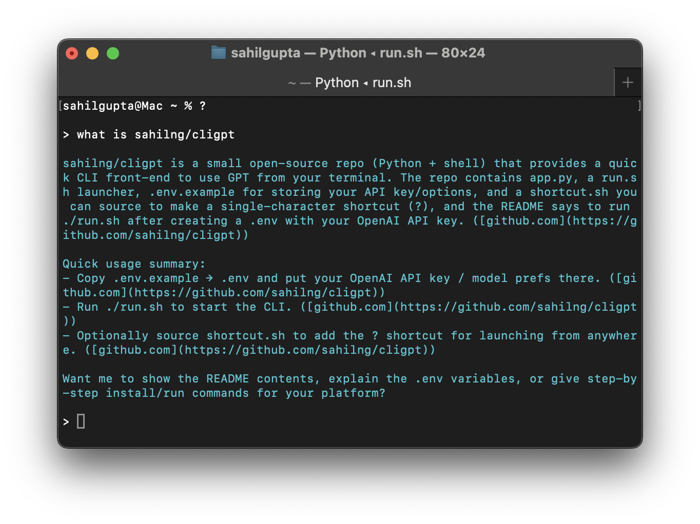

# cligpt (aka ?)

A quick and easy way to use GPT in the CLI.

## Usage

Create a `.env` based on `.env.example` to save API key, model, streaming, and web-search preferences.

To add the `?` shortcut, do `source shortcut.sh`.

Then, use `?` in your terminal to launch cligpt from anywhere.

