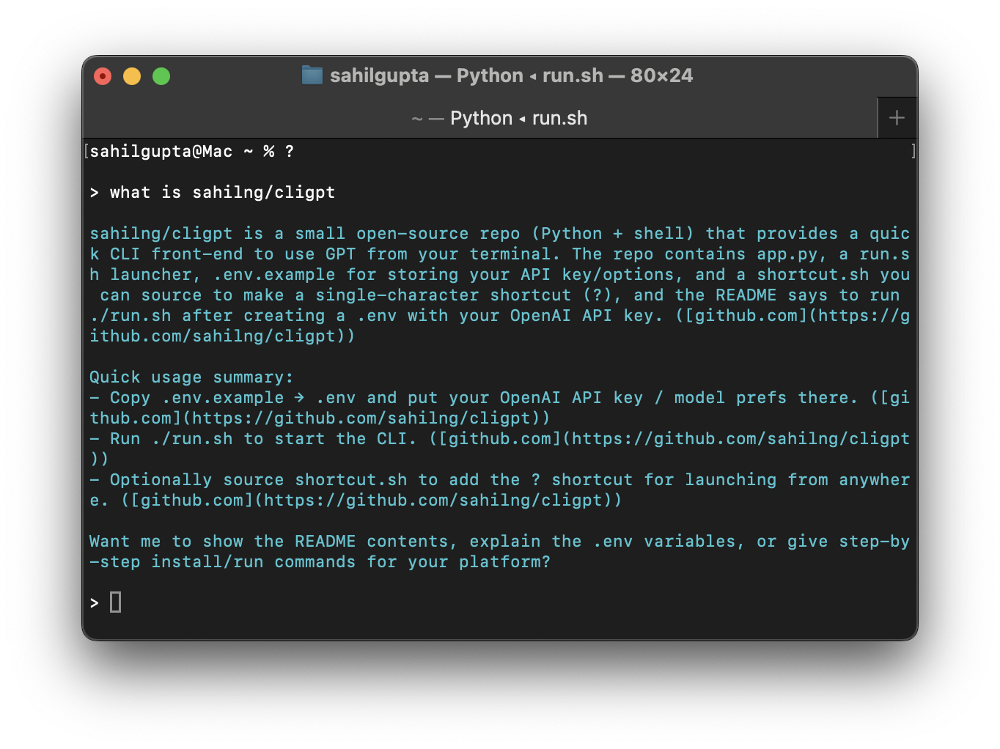

# cligpt (aka ?)

*A quick and easy way to use GPT in the CLI.*

## Usage

1. Install Python 3 with `pip` and `venv` support, then open a terminal in this repository.
2. Copy the example configuration with `cp .env.example .env`. Edit `.env` to set your API key, model, streaming, and web-search preferences.
3. Run `./run.sh` to launch cligpt. It creates a virtual environment if needed and installs dependencies automatically.
4. To add the optional `?` shortcut, exit cligpt with `Ctrl-C`, then run `source shortcut.sh` from the repository in Bash or Zsh. This adds the alias to your shell configuration and activates it in the current shell.
5. Use `?` in your terminal to launch cligpt from anywhere.

Set `MARKDOWN=false` to disable terminal markdown rendering. When `STREAM=true` and markdown rendering is enabled, responses render after completion so lists, code blocks, and tables format correctly.

### Key bindings

| Key | Action |
|-----|--------|
| `Enter` | Insert a newline |
| `Enter` twice | Submit, keeping the newline from the first press |
| `\` then `Enter` | Insert a newline and remove the backslash; the next `Enter` also inserts a newline (use for blank lines) |
| Paste | Insert text, preserving newlines; press `Enter` twice afterward to submit |
| `Esc`, then `Enter` | Submit literally, including a trailing backslash (press in quick succession) |
| `Ctrl-C` | Exit |

The two Enter presses must be consecutive, with no timing requirement. Typing, pasting, or moving the cursor between them starts over. The second press submits without adding another newline.

Multiline paste uses bracketed paste, which keeps pasted newlines from counting as Enter presses. Paste normally in macOS Terminal, review the text, then press `Enter` twice to send. Use `Esc`, then `Enter` to submit immediately without adding a newline, including text ending in a literal backslash.

`Alt+Enter` also submits literally when your terminal sends Escape/Meta. Modified Enter shortcuts may arrive as plain `Enter`, so the main controls require no modifier-key configuration.

